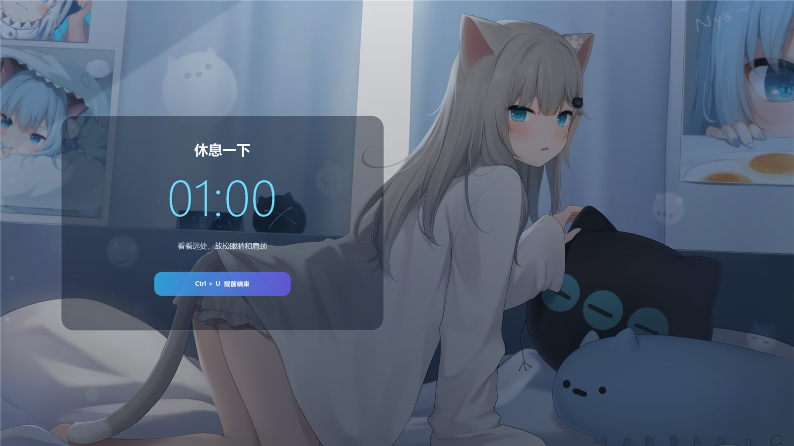

# Take Rest

一个轻量、无需安装的 Windows 休息提醒器。平时以置顶悬浮窗显示专注时间，每隔随机 15–20 分钟让所有显示器同时进入 1 分钟全屏休息倒计时，结束后自动恢复。


## 下载与运行

1. 下载仓库中的 [BreakReminder.exe](./BreakReminder.exe)。
2. 双击运行，无需安装或管理员权限。
3. 如果旧版本仍在运行，请先从系统托盘右键退出旧版本。

该程序未进行商业代码签名，Windows 首次运行时可能显示安全提示。源码和构建脚本均在本仓库中，可自行审查并重新编译。

## 功能

- 每轮随机专注 15–20 分钟，避免机械固定的提醒节奏。
- 检测所有显示器，并在每块屏幕上创建独立、同步的全屏休息界面。
- 全屏休息倒计时持续 1 分钟，结束后自动关闭全部覆盖层并开始下一轮。
- 全屏背景使用内嵌图片，复制单个 `BreakReminder.exe` 即可运行。
- 悬浮窗置顶、可自由拖动，并显示剩余时间与本轮进度。
- 点击“立即休息”可随时开始 1 分钟全屏倒计时。
- 点击右上角最小化按钮可隐藏到系统托盘，后台计时不会中断。
- 双击托盘图标恢复悬浮窗；右键可立即休息、重新计时或退出。
- 休息期间隐藏托盘入口，并屏蔽 `Esc`、`Alt+F4`、关闭窗口和程序退出命令。
- 休息期间唯一的手动提前结束方式是 `Ctrl+U`。
- 支持高 DPI 和不同分辨率、不同排列方式的多显示器。
- 单实例运行，不会重复启动多个提醒窗口。

## 全屏休息界面



## 操作速查

| 操作 | 结果 |
| --- | --- |
| 拖动悬浮窗文字区域 | 移动悬浮窗 |
| 点击“立即休息” | 立即进入 1 分钟全屏倒计时 |
| 点击 `—` | 最小化到系统托盘 |
| 双击托盘图标 | 恢复悬浮窗 |
| 全屏时按 `Ctrl+U` | 提前结束所有显示器上的休息界面 |
| 全屏时按 `Esc` 或 `Alt+F4` | 不执行任何退出操作 |
| 点击悬浮窗 `×` | 退出程序 |
| 托盘图标右键 | 显示、立即休息、重新计时或退出 |

## 从源码构建

程序使用 Windows Forms 和 Windows 自带的 .NET Framework 4.x C# 编译器，不依赖 Visual Studio 或额外的 SDK。

在 PowerShell 中运行：

```powershell
.\build.ps1
```

构建完成后会在仓库根目录生成 `BreakReminder.exe`。

## 文件说明

| 文件 | 用途 |
| --- | --- |
| `BreakReminder.cs` | 程序源码和全部界面逻辑 |
| `assets/break-background.jpg` | 嵌入程序的全屏休息背景 |
| `app.manifest` | DPI、系统兼容性和权限声明 |
| `build.ps1` | 本地编译脚本 |
| `BreakReminder.exe` | 已编译的 Windows 程序 |

程序不会联网，不会写入注册表，也不会自行设置开机启动。
